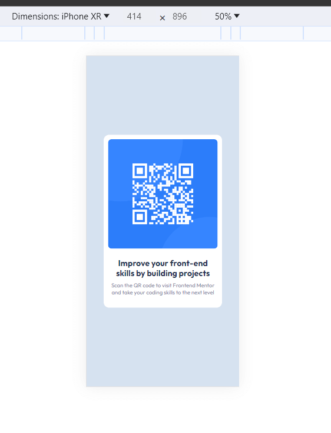
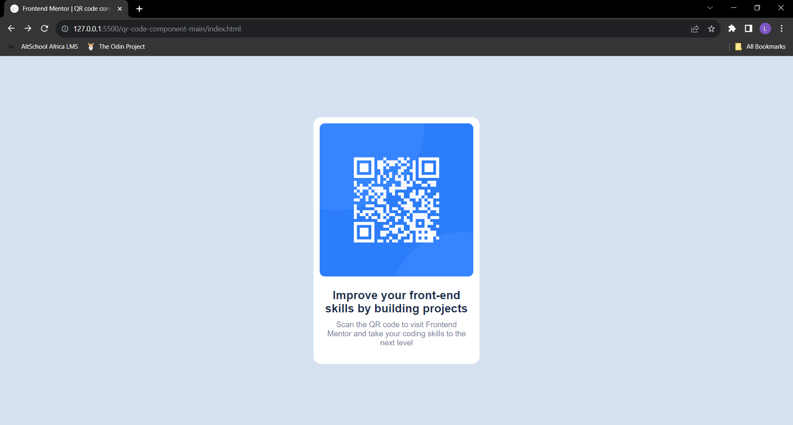

# Frontend Mentor - QR code component solution

This is a solution to the [QR code component challenge on Frontend Mentor](https://www.frontendmentor.io/challenges/qr-code-component-iux_sIO_H). Frontend Mentor challenges help you improve your coding skills by building realistic projects. 

## Table of contents

- [Overview](#overview)
  - [Screenshot](#screenshot)
  - [Links](#links)
- [My process](#my-process)
  - [Built with](#built-with)
  - [What I learned](#what-i-learned)
- [Author](#author)

## Overview
Today I created a QR code component using html and css. I gained a better understanding of css selectors

### Screenshot

 -mobile view
 -desktop view

### Links

- Solution URL: [Add solution URL here](https://github.com/Ehmkayel/FrontendMentor-Practices.git)
- Live Site URL: [Add live site URL here](https://ehmkayel.github.io/FrontendMentor-Practices/)

## My process
I downloaded the zip file from frontend mentor github,
Opened the folder on my vscode
I created some div container so as to structure my work and I added some class attributes to make my styling easier,
after completing the html structure, I created an external css file which I used in styling my html(to keep my code organized).
then I use some css selectors and properties when styling my code

### Built with

- Semantic HTML5 markup
- QR Image
- Css selectors
- CSS custom properties
- Flexbox
- Multi line comments and html comments

### What I learned

I learned how to use markups and I brushed up my html and css while creating the components

## Author

- Linkedin - [Lamidi Morufat Kajogbola](https://www.linkedin.com/in/morufat-lamidi)
- Frontend Mentor - [@Ehmkayel](https://www.frontendmentor.io/profile/Ehmkayel)
- Twitter - [@kamalehmk](https://www.twitter.com/kamalehmk)

